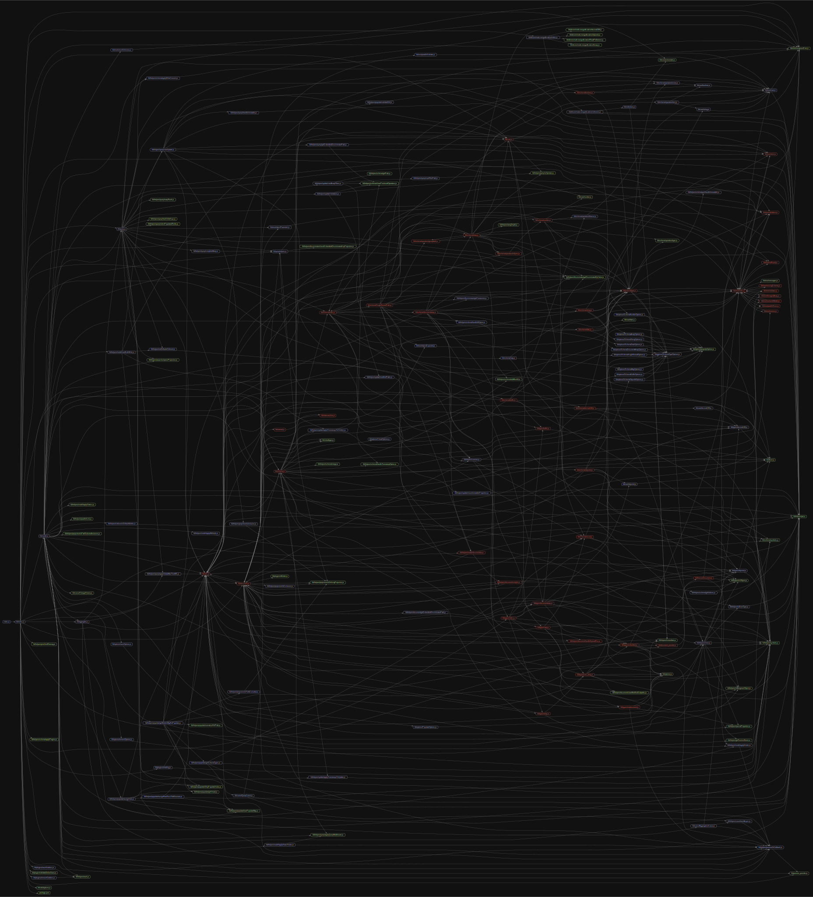

# 源码分析

## 文件结构

``` bash
/Users/liufang/openSource/FunnyLiu/mongoose
├── lib
|  ├── aggregate.js
|  ├── browser.js
|  ├── browserDocument.js
|  ├── cast
|  |  ├── boolean.js
|  |  ├── date.js
|  |  ├── decimal128.js
|  |  ├── number.js
|  |  ├── objectid.js
|  |  └── string.js
|  ├── cast.js
|  ├── collection.js
|  ├── connection.js
|  ├── connectionstate.js
|  ├── cursor
|  |  ├── AggregationCursor.js
|  |  ├── ChangeStream.js
|  |  └── QueryCursor.js
|  ├── document.js
|  ├── document_provider.js
|  ├── driver.js
|  ├── drivers
|  |  ├── SPEC.md
|  |  ├── browser
|  |  |  ├── ReadPreference.js
|  |  |  ├── binary.js
|  |  |  ├── decimal128.js
|  |  |  ├── index.js
|  |  |  └── objectid.js
|  |  └── node-mongodb-native
|  |     ├── ReadPreference.js
|  |     ├── binary.js
|  |     ├── collection.js
|  |     ├── connection.js
|  |     ├── decimal128.js
|  |     ├── index.js
|  |     └── objectid.js
|  ├── error
|  |  ├── browserMissingSchema.js
|  |  ├── cast.js
|  |  ├── disconnected.js
|  |  ├── divergentArray.js
|  |  ├── index.js
|  |  ├── messages.js
|  |  ├── missingSchema.js
|  |  ├── mongooseError.js
|  |  ├── notFound.js
|  |  ├── objectExpected.js
|  |  ├── objectParameter.js
|  |  ├── overwriteModel.js
|  |  ├── parallelSave.js
|  |  ├── parallelValidate.js
|  |  ├── serverSelection.js
|  |  ├── strict.js
|  |  ├── validation.js
|  |  ├── validator.js
|  |  └── version.js
|  ├── helpers
|  |  ├── arrayDepth.js
|  |  ├── clone.js
|  |  ├── common.js
|  |  ├── cursor
|  |  |  └── eachAsync.js
|  |  ├── discriminator
|  |  |  ├── checkEmbeddedDiscriminatorKeyProjection.js
|  |  |  ├── getConstructor.js
|  |  |  └── getDiscriminatorByValue.js
|  |  ├── document
|  |  |  ├── cleanModifiedSubpaths.js
|  |  |  ├── compile.js
|  |  |  ├── getEmbeddedDiscriminatorPath.js
|  |  |  └── handleSpreadDoc.js
|  |  ├── each.js
|  |  ├── get.js
|  |  ├── getFunctionName.js
|  |  ├── immediate.js
|  |  ├── indexes
|  |  |  └── isDefaultIdIndex.js
|  |  ├── isBsonType.js
|  |  ├── isMongooseObject.js
|  |  ├── isObject.js
|  |  ├── model
|  |  |  ├── applyHooks.js
|  |  |  ├── applyMethods.js
|  |  |  ├── applyStaticHooks.js
|  |  |  ├── applyStatics.js
|  |  |  ├── castBulkWrite.js
|  |  |  └── discriminator.js
|  |  ├── once.js
|  |  ├── parallelLimit.js
|  |  ├── populate
|  |  |  ├── SkipPopulateValue.js
|  |  |  ├── assignRawDocsToIdStructure.js
|  |  |  ├── assignVals.js
|  |  |  ├── getModelsMapForPopulate.js
|  |  |  ├── getSchemaTypes.js
|  |  |  ├── getVirtual.js
|  |  |  ├── leanPopulateMap.js
|  |  |  ├── normalizeRefPath.js
|  |  |  └── validateRef.js
|  |  ├── printJestWarning.js
|  |  ├── projection
|  |  |  ├── isDefiningProjection.js
|  |  |  ├── isExclusive.js
|  |  |  ├── isInclusive.js
|  |  |  ├── isPathExcluded.js
|  |  |  ├── isPathSelectedInclusive.js
|  |  |  └── parseProjection.js
|  |  ├── promiseOrCallback.js
|  |  ├── query
|  |  |  ├── applyGlobalMaxTimeMS.js
|  |  |  ├── applyQueryMiddleware.js
|  |  |  ├── castFilterPath.js
|  |  |  ├── castUpdate.js
|  |  |  ├── completeMany.js
|  |  |  ├── getEmbeddedDiscriminatorPath.js
|  |  |  ├── handleImmutable.js
|  |  |  ├── hasDollarKeys.js
|  |  |  ├── isOperator.js
|  |  |  ├── selectPopulatedFields.js
|  |  |  └── wrapThunk.js
|  |  ├── schema
|  |  |  ├── addAutoId.js
|  |  |  ├── applyPlugins.js
|  |  |  ├── applyWriteConcern.js
|  |  |  ├── cleanPositionalOperators.js
|  |  |  ├── getIndexes.js
|  |  |  ├── getPath.js
|  |  |  ├── handleIdOption.js
|  |  |  ├── handleTimestampOption.js
|  |  |  └── merge.js
|  |  ├── schematype
|  |  |  └── handleImmutable.js
|  |  ├── setDefaultsOnInsert.js
|  |  ├── specialProperties.js
|  |  ├── symbols.js
|  |  ├── update
|  |  |  ├── applyTimestampsToChildren.js
|  |  |  ├── applyTimestampsToUpdate.js
|  |  |  ├── castArrayFilters.js
|  |  |  ├── modifiedPaths.js
|  |  |  └── moveImmutableProperties.js
|  |  └── updateValidators.js
|  ├── index.js
|  ├── internal.js
|  ├── model.js
|  ├── options
|  |  ├── PopulateOptions.js
|  |  ├── SchemaArrayOptions.js
|  |  ├── SchemaBufferOptions.js
|  |  ├── SchemaDateOptions.js
|  |  ├── SchemaDocumentArrayOptions.js
|  |  ├── SchemaMapOptions.js
|  |  ├── SchemaNumberOptions.js
|  |  ├── SchemaObjectIdOptions.js
|  |  ├── SchemaSingleNestedOptions.js
|  |  ├── SchemaStringOptions.js
|  |  ├── SchemaTypeOptions.js
|  |  ├── VirtualOptions.js
|  |  ├── propertyOptions.js
|  |  ├── removeOptions.js
|  |  └── saveOptions.js
|  ├── options.js
|  ├── plugins
|  |  ├── idGetter.js
|  |  ├── removeSubdocs.js
|  |  ├── saveSubdocs.js
|  |  ├── sharding.js
|  |  └── validateBeforeSave.js
|  ├── promise_provider.js
|  ├── query.js
|  ├── queryhelpers.js
|  ├── schema
|  |  ├── SingleNestedPath.js
|  |  ├── array.js
|  |  ├── boolean.js
|  |  ├── buffer.js
|  |  ├── date.js
|  |  ├── decimal128.js
|  |  ├── documentarray.js
|  |  ├── index.js
|  |  ├── map.js
|  |  ├── mixed.js
|  |  ├── number.js
|  |  ├── objectid.js
|  |  ├── operators
|  |  |  ├── bitwise.js
|  |  |  ├── exists.js
|  |  |  ├── geospatial.js
|  |  |  ├── helpers.js
|  |  |  ├── text.js
|  |  |  └── type.js
|  |  ├── string.js
|  |  └── symbols.js
|  ├── schema.js
|  ├── schematype.js
|  ├── statemachine.js
|  ├── types
|  |  ├── array.js
|  |  ├── buffer.js
|  |  ├── core_array.js
|  |  ├── decimal128.js
|  |  ├── documentarray.js
|  |  ├── embedded.js
|  |  ├── index.js
|  |  ├── map.js
|  |  ├── objectid.js
|  |  └── subdocument.js
|  ├── utils.js
|  ├── validoptions.js
|  └── virtualtype.js
├── static.js
└── website.js

directory: 125 file: 1087

ignored: directory (1)

```

## 外部模块依赖

请在： http://npm.broofa.com?q=mongoose 查看

## 内部模块依赖


  